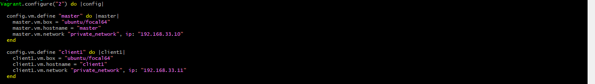
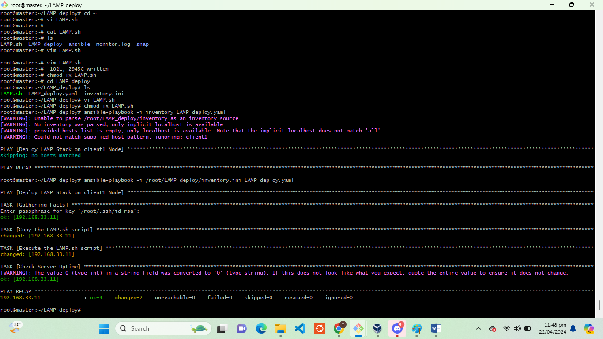
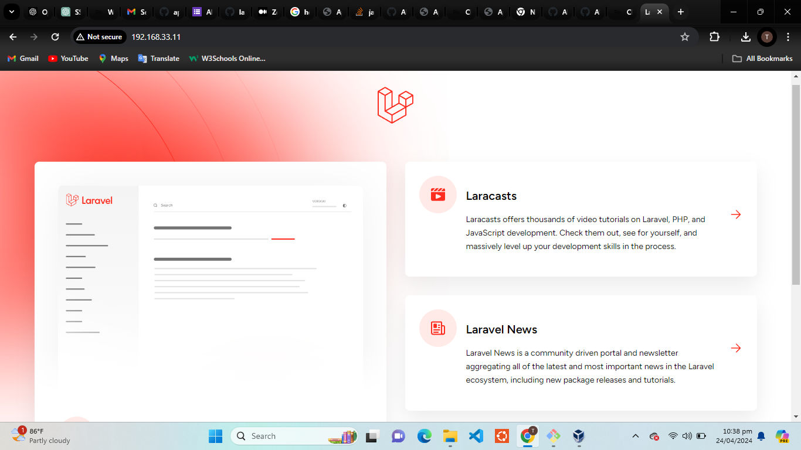

# Altschool-cloud-engineering-2nd-semester-exam
Deploy LAMP Stack

#### Automate the provisioning of two Ubuntu-based servers, named “Master” and “Slave”, using Vagrant.
#### On the Master node, create a bash script to automate the deployment of a LAMP (Linux, Apache, MySQL, PHP) stack.
#### This script should clone a PHP application from GitHub, install all necessary packages, and configure Apache web server and MySQL. 
#### Ensure the bash script is reusable and readable.
#### Using an Ansible playbook:
#### Execute the bash script on the Slave node and verify that the PHP application is accessible through the VM’s IP address (take screenshot of this as evidence)
#### Create a cron job to check the server’s uptime every 12 am.

### Answers
i. I edited my vagrantfile to automate the provisioning of two ubuntu servers as illustrated below:

ii. The machines were spinned up using `vagrant up` followed by `vagrant ssh master` and `vagrant ssh slave` using different bash windows. and I was able to SSH into the slave machine from the master using a generated public key.

iii. Afterwards, I wrote my script on the master node, which was made executable with the commande `chmod +x LAMP.sh`, then the script was executed by using the command `./LAMP.sh`

iv. Furthermore, I created a host inventory file to store my remote server's IP address, then wrote my ansible playbook.

v. The ansible playbook was executed with the command `ansible-playbook -i /root/LAMP_deploy/inventory.ini LAMP_deploy.yaml`and the result is given in the image below:

vi. The above command copies the script for the LAMP stack installation to my remote server (slave), which has been added into my inventory file on the master node. The script was tested by execution with `./LAMP.sh` on the slave node, and the script installed the LAMP stack also on the slave node.

vii. The IP address of the slave machine was loaded on a browser to confirm the installation, and this was confirmed working as it was able to load the laravel default page.

